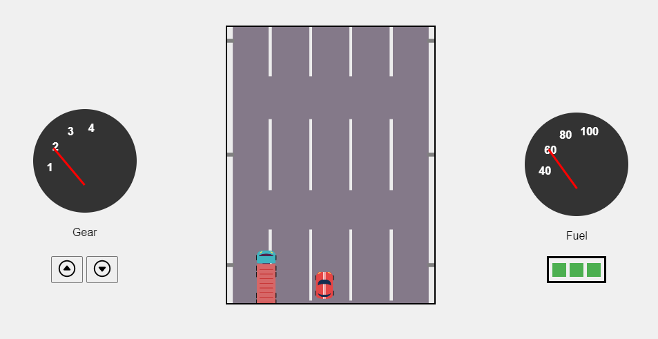

# HTML5 Canvas API - Game Development Architecture

## Introduction

Welcome to the HTML5 Canvas API Game Development Architecture! This repository serves as a foundation for building 2D games using the HTML5 Canvas API. While it was initially inspired by the classic "Road Fighter" game, it's designed to be a versatile and reusable framework for creating various HTML5 games.

## Disclaimer

- **Usage for Personal Projects**: This project is intended for personal use and educational purposes only. It should not be used for commercial gains without proper authorization from the author.

- **Work in Progress**: Please note that this project is currently a work in progress. The author is actively working on documentation and plans to use it for an upcoming course. As a result, it may not be fully documented or production-ready.

## Features

- HTML5 Canvas Integration: Utilizes the power of the HTML5 Canvas API for rendering graphics and animations.

- Game Loop: Implements a basic game loop for smooth and interactive gameplay.

- Customizable: Designed to be easily customizable and extensible for various game concepts.

## Getting Started

To get started with this architecture, follow these steps:

1. Clone this repository to your local machine.

